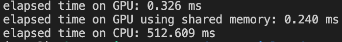

# cuda_tutorial
This repository contains some examples for CUDA C++ programming. Specifically, these examples include some CUDA kernel functions, e.g., matrix addition, matrix multiplication, etc. The main goal is to achieve fast training and inference with Large Language Model (LLM) via parallelizing and fusing some operators suited for GPU. The following screenshot shows the average time consumed over 5 runs on different platforms.

